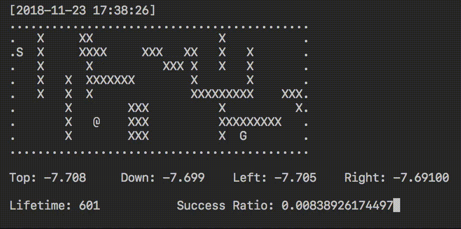
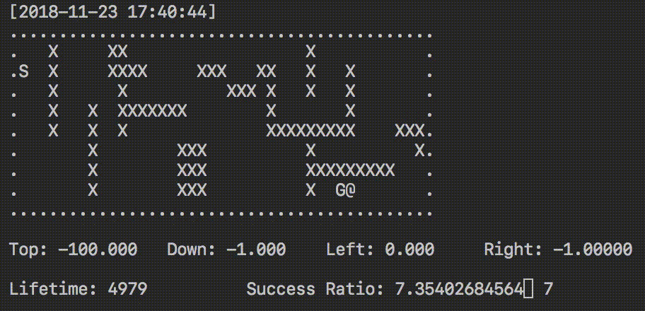

# Q Learning Visualizer
## Overview
Q-learning is a reinforcement learning technique used in machine learning. The goal of Q-learning is to learn a policy, which tells an agent what action to take under what circumstances. It does not require a model of the environment and can handle problems with stochastic transitions and rewards, without requiring adaptations.

In this tool, we are using `curses` to render our map and various simulation statistics such as Q-Table entry at a particular state. The following are some examples of the program running:

Untrained Agent Exploration | Trained Agent Navigation
------------ | -------------
 | 


## Usage
You can build your own map as long as it fits into a rectangular shape. Alternatively, you can experiment with the few maps included in this repository. Start the simulation with the following commands:

```
python rlearn.py <name of map>     Example : python rlearn.py cliff.txt
```

You can press `space` to skip a few training generations and `esc` to exit the simulation.

## Customization
Apart from the map, you may feel free to modify various aspects of the code such as refresh rate of the visualization, if you wish to have pre-training and the learning policy.

__Learning Policy__ - In the initialization of the `Agent` object, you can state if you wish to use `qlearn (default)` or `sarsa` policies

__Refresh Rate__ - `Line 290 : sleep_time = 0.1`, modify the corresponding per-loop sleep time

__Pre-Training__ - `Line 294 : my_agent.fastforward(100000)`, modify the amount of cycles to move forward

#### Custom Map Creation
```
When creating your own map, the following are the interpreted symbols:
'x' - represents a deadly object that the agent should avoid stepping on
'.' - represents an obstacle that is non-lethal, but blocks any movement
'S' - represents the starting point
'G' - represents the end point
```
